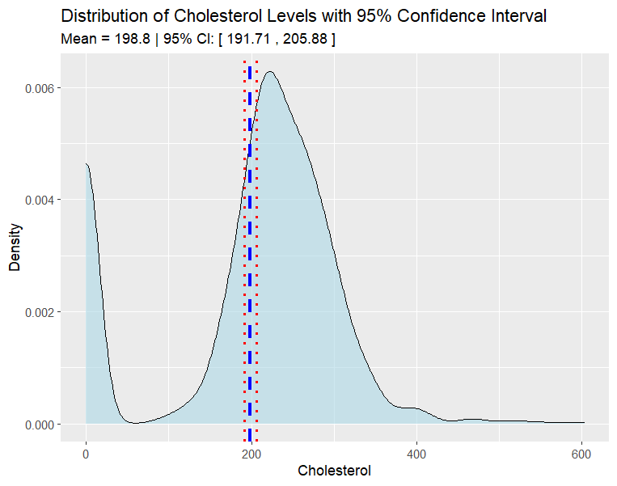
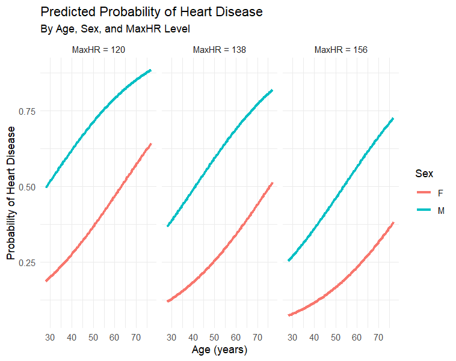
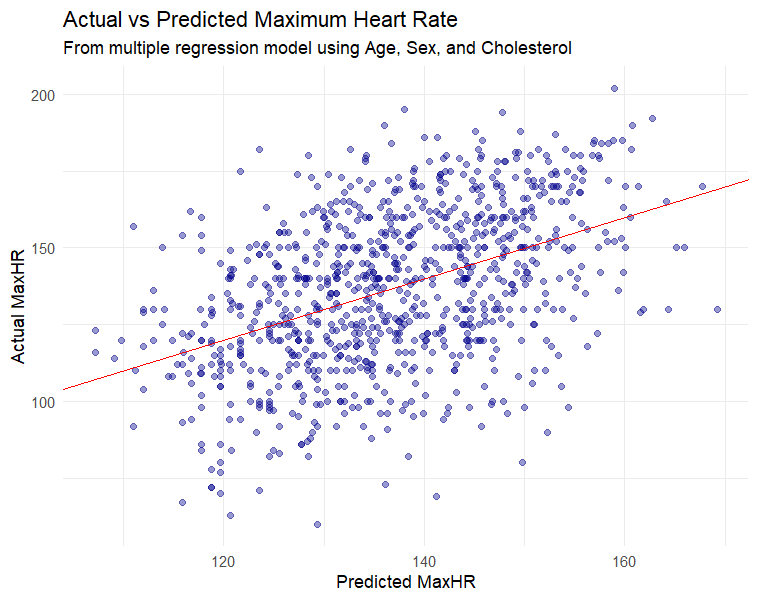
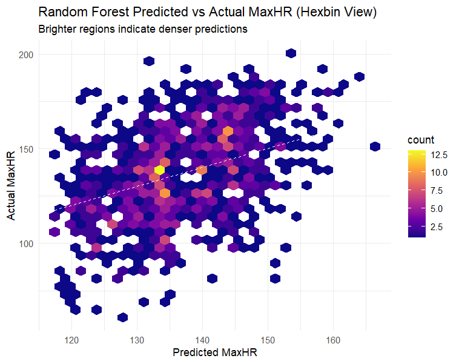

# 🩵 Heart Disease Risk Analysis and Prediction

## 📄 Project Summary
This project investigates clinical factors associated with heart disease using both statistical analysis and machine learning. It focuses on identifying risk patterns and building models that can support early diagnosis and prevention, especially for high-risk individuals.

## 📊 Dataset Overview
- **Source**: [UCI Heart Disease Repository](https://archive.ics.uci.edu/ml/machine-learning-databases/heart-disease/)
- **Compiled From**: Cleveland, Hungarian, Switzerland, Long Beach VA, and Statlog datasets
- **Final Size**: 918 observations, 11 common features
- **Target Variable**: `HeartDisease` (1 = disease, 0 = no disease)

**Citation**:  
fedesoriano. (Sept 2021). *Heart Failure Prediction Dataset*. Retrieved from [Kaggle](https://www.kaggle.com/fedesoriano/heart-failure-prediction)

## 🌐 Objective
To extract insights and build predictive models that can estimate a patient's risk of heart disease using clinical attributes.

## ⚖️ Analytical Methods

### 1. Confidence Intervals
- Estimated 95% CIs for population means (e.g., Cholesterol, RestingBP)
- Example: Cholesterol 95% CI = [131.2, 133.6] mg/dL

### 2. Hypothesis Testing
- **One-sample t-test**: Tested if mean RestingBP ≠ 130 mmHg
- **Two-sample t-test**: Compared mean Cholesterol by Sex (F > M, p < 0.001)

### 3. Linear Regression
- **Simple**: MaxHR ~ Age (MaxHR decreases ~1 bpm/year)
- **Multiple**: MaxHR ~ Age + Sex + Cholesterol (Adjusted R² ≈ 0.20)
- **Polynomial**: Added Age² term to capture curvature in MaxHR decline

### 4. Random Forest Regression
- Modeled MaxHR using Age, Sex, and Cholesterol
- Improved flexibility and captured nonlinear interactions
- Variable importance: Age > Sex > Cholesterol

### 5. Logistic Regression
- Predicted `HeartDisease` using Age, Sex, MaxHR
- Odds Ratios:
  - Age: OR = 1.04
  - Sex (M): OR = 4.27
  - MaxHR: OR = 0.97 (protective)
- Visualized predicted probabilities by Age and MaxHR levels

## 💡 Key Insights

### 1. Cholesterol Levels & Distribution
The average cholesterol level across patients is approximately **198.8 mg/dL**, with a **95% confidence interval** of [191.71, 205.88]. This range confirms the central tendency of cholesterol in the clinic population.

---

### 2. Age and Heart Disease
Patients diagnosed with heart disease have a **mean age of 55.9 years**, with a narrow confidence interval [55.14, 56.66], suggesting a concentrated age group among high-risk individuals.

.png)

---

### 3. Prevalence of Heart Disease
Approximately **54% of patients** in the dataset have been diagnosed with heart disease, based on the proportion and 95% confidence interval [0.521, 0.586].

.png)

---

### 4. Gender-based Cholesterol Differences
A **two-sample t-test** revealed a statistically significant difference in cholesterol levels between males and females (**p-value < 0.001**). Females had notably higher average cholesterol levels.

.png)

---

### 5. Age vs. Maximum Heart Rate
A **negative linear relationship** was observed between age and maximum heart rate, confirmed with regression and confidence intervals. As age increases, max heart rate decreases.

.png)

---

### 6. Logistic Regression: Heart Disease Prediction
Logistic regression modeling showed a rising **probability of heart disease** with increasing age and decreasing heart rate, varying by gender and heart rate brackets.

---

### 7. Multiple Regression (Predicted vs Actual MaxHR)
A multiple regression model using age, sex, and cholesterol predicted max heart rate reasonably well, though some variation remained.

---

### 8. Random Forest Regression (Hexbin)
Random Forest outperformed linear models in capturing complex, nonlinear relationships between features and actual heart rate, as shown by dense prediction regions.

## 🛠️ Tools Used
- **Language**: R
- **Key Libraries**: `dplyr`, `ggplot2`, `randomForest`, `stats`, `mgcv`, `hexbin`
- **Methods**: t-tests, CI, regression, machine learning
- **Visuals**: boxplots, coefficient plots, hexbin density, probability curves

## 📂 Files Included
- `heart.csv`: cleaned dataset
- `statistical analysis.R`: main analysis script
- `README.md`: project documentation
- Visual plots: PNG files for model and statistical outputs
